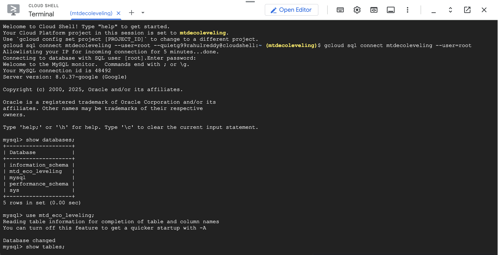
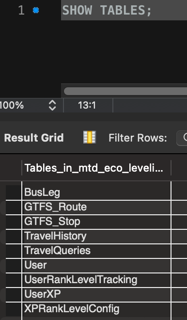
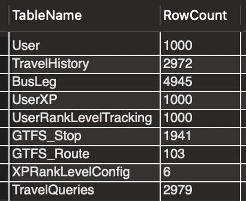
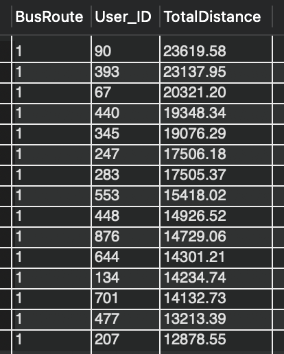
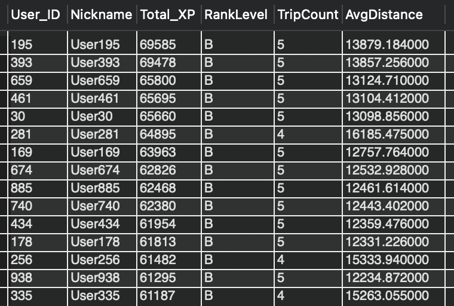
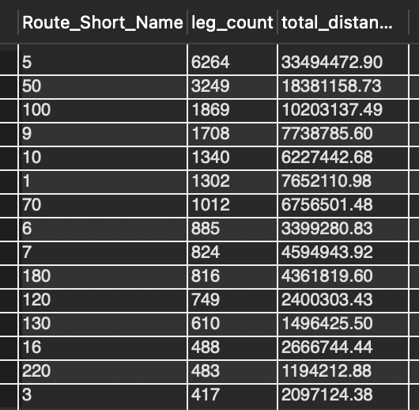
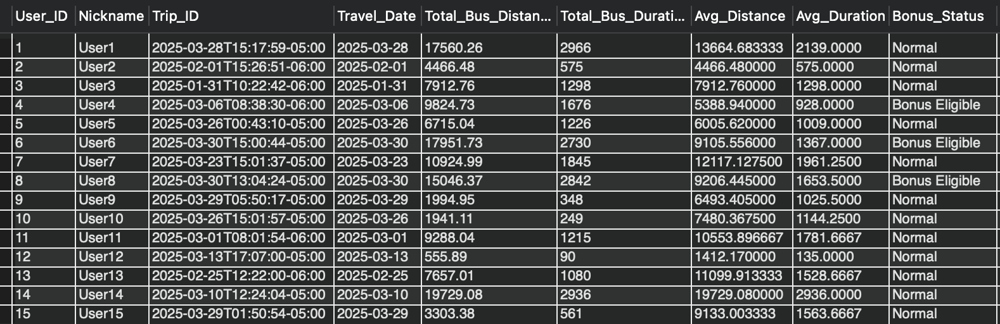

# Database Design and Indexing (Stage 3)

  This document outlines our work for Stage 3, including our database implementation, advanced SQL queries, and indexing analysis.

## Some Updates:

   For Stage 3, we made a few adjustments and updates to our schema as explained below:
      
      1. Table TravelQueries was added.
         It's functional dependencies (FDs) are:
         Query_ID (PK) -> User_ID, History_ID, Start_Lat, Start_Lon, End_Lat, End_Lon, dateTime.
         Since User_ID is the primary key (PK), and this is the only FD, TravelQueries table is in 3NF.
      3. Table GTFS_Stop had 2 additional columns (Stop_Code & Stop_URL) added.
         It's functional dependencies (FDs) are:
         Stop_ID (PK) -> Stop_Name, Stop_Lat, Stop_Lon, Stop_Code, Stop_URL.
         Since Stop_ID is the primary key (PK), and this is the only FD, TravelQueries table is in 3NF.
      4. Table User_Level was renamed to UserXP.
      5. Table Level_Config was renamed to XPRankLevelConfig.
      6. Table User_Level_Progress was renamed to UserRankLevelTracking.
      7. Column Level_Number has been renamed to RankLevel in XPRankLevelConfig & UserRankLevelTracking.
      8. Column Title has been dropped from XPRankLevelConfig because it was redundant.

---
## 1. Database Implementation
### 1.1 Connection
  
  
### 1.2 DDL Commands
```
CREATE TABLE User (
   User_ID INT PRIMARY KEY,
   Nickname VARCHAR(50),
   Email VARCHAR(100) UNIQUE,
   Password_Hash VARCHAR(255),
   Created_At TIMESTAMP,
   Updated_At TIMESTAMP
 );

CREATE TABLE TravelHistory (
   History_ID INT PRIMARY KEY,
   User_ID INT NOT NULL,
   Trip_ID VARCHAR(50) UNIQUE,
   Travel_Date DATE NOT NULL,
   Total_Bus_Duration INT,
   Total_Bus_Distance DECIMAL(10,2),
   Notes TEXT,
   Trip_Rating DECIMAL(3,1),
   Created_At TIMESTAMP NOT NULL DEFAULT CURRENT_TIMESTAMP,
   Updated_At TIMESTAMP,
   FOREIGN KEY (User_ID) REFERENCES User(User_ID) ON DELETE CASCADE
 );
 
 CREATE TABLE BusLeg (
   Leg_ID INT PRIMARY KEY,
   History_ID INT NOT NULL,
   Mode VARCHAR(20) NOT NULL,
   StartTime TIMESTAMP NOT NULL,
   EndTime TIMESTAMP NOT NULL,
   Duration INT NOT NULL,
   Distance DECIMAL(10,2) NOT NULL,
   FromPlace VARCHAR(100) NOT NULL,
   ToPlace VARCHAR(100) NOT NULL,
   BusRoute VARCHAR(20) NOT NULL,
   Polyline TEXT NOT NULL,
   Created_At TIMESTAMP NOT NULL,
   Updated_At TIMESTAMP,
   FOREIGN KEY (History_ID) REFERENCES TravelHistory(History_ID) ON DELETE CASCADE
 );

CREATE TABLE GTFS_Stop (
    Stop_ID VARCHAR(20) PRIMARY KEY,
    Stop_Name VARCHAR(100),
    Stop_Lat DECIMAL(17,15),
    Stop_Lon DECIMAL(17,15),
    Stop_Code VARCHAR(50),
    Stop_URL VARCHAR(255)
);

CREATE TABLE GTFS_Route (
    Route_ID VARCHAR(50) PRIMARY KEY,
    Agency_ID VARCHAR(50),
    Route_Short_Name VARCHAR(50),
    Route_Long_Name VARCHAR(255),
    Route_Desc TEXT,
    Route_Type INT,
    Route_URL VARCHAR(255),
    Route_Color VARCHAR(6),
    Route_Text_Color VARCHAR(6),
    Route_Sort_Order INT
);

CREATE TABLE TravelQueries (
  Query_ID INT AUTO_INCREMENT PRIMARY KEY,
  User_ID INT,
  History_ID INT,
  Start_Lat DECIMAL(17,15),
  Start_Lon DECIMAL(17,15),
  End_Lat DECIMAL(17,15),
  End_Lon DECIMAL(17,15),
  dateTime TIMESTAMP,
  FOREIGN KEY (User_ID) REFERENCES User(User_ID) ON DELETE CASCADE,
  FOREIGN KEY (History_ID) REFERENCES TravelHistory(History_ID) ON DELETE CASCADE
);

CREATE TABLE UserXP (
   User_ID INT PRIMARY KEY,
   Total_XP INT NOT NULL,
   Updated_At TIMESTAMP NOT NULL DEFAULT CURRENT_TIMESTAMP,
   FOREIGN KEY (User_ID) REFERENCES User(User_ID) ON DELETE CASCADE
 );
 
 CREATE TABLE XPRankLevelConfig (
   RankLevel VARCHAR(1) PRIMARY KEY,
   Min_XP INT NOT NULL,
   Max_XP INT NOT NULL,
   CHECK(Min_XP < Max_XP)
 );
 
 CREATE TABLE UserRankLevelTracking (
   User_ID INT NOT NULL,
   RankLevel VARCHAR(1) NOT NULL,
   Updated_At TIMESTAMP NOT NULL DEFAULT CURRENT_TIMESTAMP,
   PRIMARY KEY (User_ID),
   FOREIGN KEY (User_ID) REFERENCES User(User_ID) ON DELETE CASCADE,
   FOREIGN KEY (RankLevel) REFERENCES XPRankLevelConfig(RankLevel) ON DELETE CASCADE
 );
```
### 1.3 Data Insertion

- Insert at least 1000 rows into at least three tables.

  
---
## 2. Advanced SQL Queries
Query1: Top Users by Total Distance on Each Bus Route

This query retrieves the top users by total distance on each bus route by comparing individual distances to the route average.
```
SELECT 
    b.BusRoute,
    t.User_ID,
    SUM(b.Distance) AS TotalDistance
FROM 
    BusLeg b
JOIN 
    TravelHistory t ON b.History_ID = t.History_ID
GROUP BY 
    b.BusRoute, t.User_ID
HAVING 
    TotalDistance > (
        SELECT AVG(sub.TotalDistance)
        FROM (
            SELECT t2.User_ID, SUM(b2.Distance) AS TotalDistance
            FROM BusLeg b2
            JOIN TravelHistory t2 ON b2.History_ID = t2.History_ID
            WHERE b2.BusRoute = b.BusRoute
            GROUP BY t2.User_ID
        ) AS sub
    )
ORDER BY 
    b.BusRoute, TotalDistance DESC
LIMIT 15;
```
 
 
Query2: Gamification Overview

This query provides a gamification overview by aggregating user experience, ranking, and travel history metrics to highlight top performers.
```
SELECT 
  u.User_ID,
  u.Nickname,
  xp.Total_XP,
  ur.RankLevel,
  COUNT(th.History_ID) AS TripCount,
  AVG(th.Total_Bus_Distance) AS AvgDistance
FROM 
  User u
JOIN 
  UserXP xp ON u.User_ID = xp.User_ID
JOIN 
  UserRankLevelTracking ur ON u.User_ID = ur.User_ID
LEFT JOIN 
  TravelHistory th ON u.User_ID = th.User_ID
GROUP BY 
  u.User_ID, u.Nickname, xp.Total_XP, ur.RankLevel
HAVING 
  xp.Total_XP > (SELECT AVG(Total_XP) FROM UserXP)
ORDER BY 
  xp.Total_XP DESC
LIMIT 15;
```
 

Query3: Most taken routes

Identify the bus routes that are used more frequently than the overall average usage.
```
SELECT 
    r.Route_Short_Name,
    COUNT(b.Leg_ID) AS leg_count,
    SUM(b.Distance) AS total_distance
FROM 
    BusLeg b
JOIN 
    GTFS_Route r ON b.BusRoute = r.Route_Short_Name
GROUP BY 
    r.Route_Short_Name
HAVING 
    COUNT(b.Leg_ID) > (
        SELECT AVG(route_usage)
        FROM (
            SELECT COUNT(*) AS route_usage
            FROM BusLeg
            GROUP BY BusRoute
        ) AS usage_summary
    )
ORDER BY 
    leg_count DESC
LIMIT 15;
```
 
 
Query4: Bonus Eligibility 

This query determines bonus eligibility based on the most recent trip performance by comparing individual trip metrics to user-specific averages.
```
SELECT 
    u.User_ID,
    u.Nickname,
    t.Trip_ID,
    t.Travel_Date,
    t.Total_Bus_Distance,
    t.Total_Bus_Duration,
    (SELECT AVG(th.Total_Bus_Distance)
     FROM TravelHistory th
     WHERE th.User_ID = u.User_ID) AS Avg_Distance,
    (SELECT AVG(th.Total_Bus_Duration)
     FROM TravelHistory th
     WHERE th.User_ID = u.User_ID) AS Avg_Duration,
    CASE 
       WHEN t.Total_Bus_Distance > (SELECT AVG(th.Total_Bus_Distance)
                                    FROM TravelHistory th
                                    WHERE th.User_ID = u.User_ID) * 1.5
         THEN 'Bonus Eligible' 
       ELSE 'Normal'
    END AS Bonus_Status
FROM 
    User u
JOIN 
    TravelHistory t ON u.User_ID = t.User_ID
WHERE 
    t.Travel_Date = (
      SELECT MAX(th2.Travel_Date) 
      FROM TravelHistory th2 
      WHERE th2.User_ID = u.User_ID
    )
ORDER BY 
    u.User_ID

LIMIT 15;
```
 
---
## 3. Indexing Analysis
Query1 
Before indexing cost:
```
-> Limit: 15 row(s)  (actual time=14097..14097 rows=15 loops=1)
    -> Sort: b.BusRoute, TotalDistance DESC  (actual time=14097..14097 rows=15 loops=1)
        -> Filter: (TotalDistance > `(select #2)`)  (actual time=14093..14094 rows=1776 loops=1)
            -> Table scan on <temporary>  (actual time=14093..14093 rows=4078 loops=1)
                -> Aggregate using temporary table  (actual time=14092..14092 rows=4078 loops=1)
                    -> Nested loop inner join  (cost=2001 rows=4857) (actual time=0.179..60 rows=4945 loops=1)
                        -> Covering index scan on t using idx_user_id  (cost=301 rows=2972) (actual time=0.0621..7.1 rows=2972 loops=1)
                        -> Index lookup on b using idx_history_id (History_ID=t.History_ID)  (cost=0.409 rows=1.63) (actual time=0.0114..0.0163 rows=1.66 loops=2972)
-> Select #2 (subquery in projection; dependent)
    -> Aggregate: avg(sub.TotalDistance)  (cost=2.5..2.5 rows=1) (actual time=3.41..3.41 rows=1 loops=4078)
        -> Table scan on sub  (cost=2.5..2.5 rows=0) (actual time=3.35..3.38 rows=235 loops=4078)
            -> Materialize  (cost=0..0 rows=0) (actual time=3.35..3.35 rows=235 loops=4078)
                -> Table scan on <temporary>  (actual time=3.29..3.32 rows=235 loops=4078)
                    -> Aggregate using temporary table  (actual time=3.29..3.29 rows=235 loops=4078)
                        -> Nested loop inner join  (cost=259 rows=486) (actual time=0.0557..3.13 rows=295 loops=4078)
                            -> Filter: (b2.BusRoute = b.BusRoute)  (cost=88.8 rows=486) (actual time=0.0513..2.74 rows=295 loops=4078)
                                -> Table scan on b2  (cost=88.8 rows=4857) (actual time=0.0438..2.22 rows=4945 loops=4078)
                            -> Single-row index lookup on t2 using PRIMARY (History_ID=b2.History_ID)  (cost=0.25 rows=1) (actual time=0.0011..0.00113 rows=1 loops=1.2e+6)
```
**Total cost = 2744.759**

Indexing 1:
```
ALTER TABLE BusLeg ADD INDEX idx_busroute (BusRoute);
```

After indexing 1 cost:
```
-> Limit: 15 row(s)  (actual time=4570..4570 rows=15 loops=1)
    -> Sort: b.BusRoute, TotalDistance DESC  (actual time=4570..4570 rows=15 loops=1)
        -> Filter: (TotalDistance > `(select #2)`)  (actual time=4562..4566 rows=1776 loops=1)
            -> Table scan on <temporary>  (actual time=4562..4564 rows=4078 loops=1)
                -> Aggregate using temporary table  (actual time=4562..4562 rows=4078 loops=1)
                    -> Nested loop inner join  (cost=2001 rows=4857) (actual time=0.0806..29.4 rows=4945 loops=1)
                        -> Covering index scan on t using idx_user_id  (cost=301 rows=2972) (actual time=0.0457..3.12 rows=2972 loops=1)
                        -> Index lookup on b using idx_history_id (History_ID=t.History_ID)  (cost=0.409 rows=1.63) (actual time=0.00583..0.0081 rows=1.66 loops=2972)
-> Select #2 (subquery in projection; dependent)
    -> Aggregate: avg(sub.TotalDistance)  (cost=2.5..2.5 rows=1) (actual time=1.1..1.1 rows=1 loops=4078)
        -> Table scan on sub  (cost=2.5..2.5 rows=0) (actual time=1.04..1.07 rows=235 loops=4078)
            -> Materialize  (cost=0..0 rows=0) (actual time=1.04..1.04 rows=235 loops=4078)
                -> Table scan on <temporary>  (actual time=0.987..1.01 rows=235 loops=4078)
                    -> Aggregate using temporary table  (actual time=0.987..0.987 rows=235 loops=4078)
                        -> Nested loop inner join  (cost=126 rows=180) (actual time=0.16..0.851 rows=295 loops=4078)
                            -> Index lookup on b2 using idx_busroute (BusRoute=b.BusRoute)  (cost=63 rows=180) (actual time=0.156..0.508 rows=295 loops=4078)
                            -> Single-row index lookup on t2 using PRIMARY (History_ID=b2.History_ID)  (cost=0.251 rows=1) (actual time=949e-6..980e-6 rows=1 loops=1.2e+6)
```
**Total cost = 2496.16**

Indexing 2:
```
ALTER TABLE BusLeg
ADD INDEX idx_busleg_func (
    BusRoute,
    (CASE WHEN Distance > 0 THEN Distance ELSE NULL END)
);
```

After indexing 2 cost:
```
-> Limit: 15 row(s)  (actual time=4556..4556 rows=15 loops=1)
    -> Sort: b.BusRoute, TotalDistance DESC  (actual time=4556..4556 rows=15 loops=1)
        -> Filter: (TotalDistance > `(select #2)`)  (actual time=4551..4553 rows=1776 loops=1)
            -> Table scan on <temporary>  (actual time=4551..4552 rows=4078 loops=1)
                -> Aggregate using temporary table  (actual time=4551..4551 rows=4078 loops=1)
                    -> Nested loop inner join  (cost=2028 rows=4697) (actual time=0.236..29.2 rows=4945 loops=1)
                        -> Covering index scan on t using TravelHistory_ibfk_1  (cost=301 rows=2972) (actual time=0.126..3.51 rows=2972 loops=1)
                        -> Index lookup on b using BusLeg_ibfk_1 (History_ID=t.History_ID)  (cost=0.423 rows=1.58) (actual time=0.00607..0.00815 rows=1.66 loops=2972)
-> Select #2 (subquery in projection; dependent)
    -> Aggregate: avg(sub.TotalDistance)  (cost=2.5..2.5 rows=1) (actual time=1.1..1.1 rows=1 loops=4078)
        -> Table scan on sub  (cost=2.5..2.5 rows=0) (actual time=1.04..1.07 rows=235 loops=4078)
            -> Materialize  (cost=0..0 rows=0) (actual time=1.04..1.04 rows=235 loops=4078)
                -> Table scan on <temporary>  (actual time=0.99..1.02 rows=235 loops=4078)
                    -> Aggregate using temporary table  (actual time=0.989..0.989 rows=235 loops=4078)
                        -> Nested loop inner join  (cost=125 rows=174) (actual time=0.162..0.856 rows=295 loops=4078)
                            -> Index lookup on b2 using idx_busleg_func (BusRoute=b.BusRoute)  (cost=63.9 rows=174) (actual time=0.159..0.496 rows=295 loops=4078)
                            -> Single-row index lookup on t2 using PRIMARY (History_ID=b2.History_ID)  (cost=0.251 rows=1) (actual time=0.001..0.00104 rows=1 loops=1.2e+6)
```
**Total cost = 2523.574**

Indexing 3:
```
ALTER TABLE BusLeg
ADD COLUMN high_distance_flag TINYINT(1) 
    GENERATED ALWAYS AS (CASE WHEN Distance > 1000 THEN 1 ELSE 0 END) STORED;

CREATE INDEX idx_busleg_high_distance_flag ON BusLeg(high_distance_flag);
```
After indexing 3 cost:
```
-> Limit: 15 row(s)  (actual time=14636..14636 rows=15 loops=1)
    -> Sort: b.BusRoute, TotalDistance DESC  (actual time=14636..14636 rows=15 loops=1)
        -> Filter: (TotalDistance > `(select #2)`)  (actual time=14634..14635 rows=1776 loops=1)
            -> Table scan on <temporary>  (actual time=14634..14634 rows=4078 loops=1)
                -> Aggregate using temporary table  (actual time=14634..14634 rows=4078 loops=1)
                    -> Nested loop inner join  (cost=2080 rows=5062) (actual time=0.151..71.9 rows=4945 loops=1)
                        -> Covering index scan on t using TravelHistory_ibfk_1  (cost=309 rows=2972) (actual time=0.0743..6.34 rows=2972 loops=1)
                        -> Index lookup on b using BusLeg_ibfk_1 (History_ID=t.History_ID)  (cost=0.426 rows=1.7) (actual time=0.0149..0.0204 rows=1.66 loops=2972)
-> Select #2 (subquery in projection; dependent)
    -> Aggregate: avg(sub.TotalDistance)  (cost=2.5..2.5 rows=1) (actual time=3.54..3.54 rows=1 loops=4078)
        -> Table scan on sub  (cost=2.5..2.5 rows=0) (actual time=3.48..3.51 rows=235 loops=4078)
            -> Materialize  (cost=0..0 rows=0) (actual time=3.48..3.48 rows=235 loops=4078)
                -> Table scan on <temporary>  (actual time=3.42..3.44 rows=235 loops=4078)
                    -> Aggregate using temporary table  (actual time=3.42..3.42 rows=235 loops=4078)
                        -> Nested loop inner join  (cost=482 rows=506) (actual time=0.058..3.25 rows=295 loops=4078)
                            -> Filter: (b2.BusRoute = b.BusRoute)  (cost=90.9 rows=506) (actual time=0.0537..2.87 rows=295 loops=4078)
                                -> Table scan on b2  (cost=90.9 rows=5062) (actual time=0.0455..2.33 rows=4945 loops=4078)
                            -> Single-row index lookup on t2 using PRIMARY (History_ID=b2.History_ID)  (cost=0.672 rows=1) (actual time=0.00105..0.00108 rows=1 loops=1.2e+6)
```
**Total cost = 3058.898**

Analysis:  Before indexing, Query 1 had a total cost of **2744.759**, mainly due to nested loop joins and full table scans on the BusLeg table.

With **Indexing 1** (idx_busroute), the cost dropped to **2496.160**, a ~9% improvement. This index supported the join on BusRoute, reducing scan overhead.

**Indexing 2** (idx_busleg_func) brought the cost to **2523.574**—slightly better than the original, but less effective than Indexing 1, as the functional part wasn’t directly used in filtering.

**Indexing 3** (idx_busleg_high_distance_flag) increased the cost to **3058.898**. The new column wasn’t relevant to the query, so the index was unused.

Overall, **keep Indexing 1**, optionally keep Indexing 2, and discard Indexing 3.

Query2 
Before indexing cost:
```
-> Limit: 15 row(s)  (actual time=14.9..14.9 rows=15 loops=1)
    -> Sort: xp.Total_XP DESC  (actual time=14.9..14.9 rows=15 loops=1)
        -> Filter: (xp.Total_XP > (select #2))  (actual time=14.4..14.7 rows=453 loops=1)
            -> Table scan on <temporary>  (actual time=14..14.2 rows=1000 loops=1)
                -> Aggregate using temporary table  (actual time=14..14 rows=1000 loops=1)
                    -> Nested loop left join  (cost=1841 rows=2972) (actual time=0.213..9.45 rows=2972 loops=1)
                        -> Nested loop inner join  (cost=801 rows=1000) (actual time=0.184..3.43 rows=1000 loops=1)
                            -> Nested loop inner join  (cost=451 rows=1000) (actual time=0.0757..1.75 rows=1000 loops=1)
                                -> Table scan on xp  (cost=101 rows=1000) (actual time=0.0586..0.386 rows=1000 loops=1)
                                -> Single-row index lookup on ur using PRIMARY (User_ID=xp.User_ID)  (cost=0.25 rows=1) (actual time=0.00116..0.00119 rows=1 loops=1000)
                            -> Single-row index lookup on u using PRIMARY (User_ID=xp.User_ID)  (cost=0.25 rows=1) (actual time=0.00147..0.0015 rows=1 loops=1000)
                        -> Index lookup on th using idx_user_id (User_ID=xp.User_ID)  (cost=0.743 rows=2.97) (actual time=0.00449..0.00565 rows=2.97 loops=1000)
            -> Select #2 (subquery in condition; run only once)
                -> Aggregate: avg(UserXP.Total_XP)  (cost=201 rows=1) (actual time=0.327..0.327 rows=1 loops=1)
                    -> Table scan on UserXP  (cost=101 rows=1000) (actual time=0.0312..0.234 rows=1000 loops=1)
```
**Total cost = 3497.243**

Indexing 1:
```
ALTER TABLE UserXP ADD INDEX idx_total_xp (Total_XP);
```

After indexing 1 cost:
```
-> Limit: 15 row(s)  (actual time=14.8..14.8 rows=15 loops=1)
    -> Sort: xp.Total_XP DESC  (actual time=14.8..14.8 rows=15 loops=1)
        -> Filter: (xp.Total_XP > (select #2))  (actual time=14.4..14.6 rows=453 loops=1)
            -> Table scan on <temporary>  (actual time=13.8..14.1 rows=1000 loops=1)
                -> Aggregate using temporary table  (actual time=13.8..13.8 rows=1000 loops=1)
                    -> Nested loop left join  (cost=1841 rows=2972) (actual time=0.101..9.52 rows=2972 loops=1)
                        -> Nested loop inner join  (cost=801 rows=1000) (actual time=0.0786..3.31 rows=1000 loops=1)
                            -> Nested loop inner join  (cost=451 rows=1000) (actual time=0.0713..1.8 rows=1000 loops=1)
                                -> Covering index scan on xp using idx_total_xp  (cost=101 rows=1000) (actual time=0.0513..0.305 rows=1000 loops=1)
                                -> Single-row index lookup on ur using PRIMARY (User_ID=xp.User_ID)  (cost=0.25 rows=1) (actual time=0.00126..0.00129 rows=1 loops=1000)
                            -> Single-row index lookup on u using PRIMARY (User_ID=xp.User_ID)  (cost=0.25 rows=1) (actual time=0.00131..0.00134 rows=1 loops=1000)
                        -> Index lookup on th using idx_user_id (User_ID=xp.User_ID)  (cost=0.743 rows=2.97) (actual time=0.00474..0.0058 rows=2.97 loops=1000)
            -> Select #2 (subquery in condition; run only once)
                -> Aggregate: avg(UserXP.Total_XP)  (cost=201 rows=1) (actual time=0.306..0.306 rows=1 loops=1)
                    -> Covering index scan on UserXP using idx_total_xp  (cost=101 rows=1000) (actual time=0.0284..0.198 rows=1000 loops=1)
```
**Total Cost = 3496.243**

Indexing 2:
```
ALTER TABLE TravelHistory ADD INDEX idx_total_bus_distance (Total_Bus_Distance);
```

After indexing 2 cost:
```
-> Limit: 15 row(s)  (actual time=209..209 rows=15 loops=1)
    -> Sort: xp.Total_XP DESC  (actual time=209..209 rows=15 loops=1)
        -> Filter: (xp.Total_XP > (select #2))  (actual time=208..209 rows=453 loops=1)
            -> Table scan on <temporary>  (actual time=208..208 rows=1000 loops=1)
                -> Aggregate using temporary table  (actual time=208..208 rows=1000 loops=1)
                    -> Nested loop left join  (cost=2851 rows=2975) (actual time=31.8..204 rows=2972 loops=1)
                        -> Nested loop inner join  (cost=1810 rows=1001) (actual time=31.6..197 rows=1000 loops=1)
                            -> Nested loop inner join  (cost=959 rows=1001) (actual time=29.3..189 rows=1000 loops=1)
                                -> Table scan on u  (cost=108 rows=1001) (actual time=26.1..143 rows=1000 loops=1)
                                -> Single-row index lookup on xp using PRIMARY (User_ID=u.User_ID)  (cost=0.75 rows=1) (actual time=0.0461..0.0461 rows=1 loops=1000)
                            -> Single-row index lookup on ur using PRIMARY (User_ID=u.User_ID)  (cost=0.75 rows=1) (actual time=0.00682..0.00686 rows=1 loops=1000)
                        -> Index lookup on th using TravelHistory_ibfk_1 (User_ID=u.User_ID)  (cost=0.743 rows=2.97) (actual time=0.00586..0.00712 rows=2.97 loops=1000)
            -> Select #2 (subquery in condition; run only once)
                -> Aggregate: avg(UserXP.Total_XP)  (cost=203 rows=1) (actual time=0.296..0.296 rows=1 loops=1)
                    -> Table scan on UserXP  (cost=103 rows=1000) (actual time=0.0254..0.209 rows=1000 loops=1)
```
**Total Cost = 6036.243**

Indexing 3:
```
ALTER TABLE User ADD INDEX idx_nickname (Nickname);
```
After indexing 3 cost:
```
-> Limit: 15 row(s)  (actual time=15.4..15.4 rows=15 loops=1)
    -> Sort: xp.Total_XP DESC  (actual time=15.4..15.4 rows=15 loops=1)
        -> Filter: (xp.Total_XP > (select #2))  (actual time=14.8..15.2 rows=453 loops=1)
            -> Table scan on <temporary>  (actual time=14.4..14.6 rows=1000 loops=1)
                -> Aggregate using temporary table  (actual time=14.4..14.4 rows=1000 loops=1)
                    -> Nested loop left join  (cost=1841 rows=2972) (actual time=0.0837..9.78 rows=2972 loops=1)
                        -> Nested loop inner join  (cost=801 rows=1000) (actual time=0.0606..3.65 rows=1000 loops=1)
                            -> Nested loop inner join  (cost=451 rows=1000) (actual time=0.0532..2.32 rows=1000 loops=1)
                                -> Table scan on xp  (cost=101 rows=1000) (actual time=0.0332..0.32 rows=1000 loops=1)
                                -> Single-row index lookup on ur using PRIMARY (User_ID=xp.User_ID)  (cost=0.25 rows=1) (actual time=0.00167..0.0017 rows=1 loops=1000)
                            -> Single-row index lookup on u using PRIMARY (User_ID=xp.User_ID)  (cost=0.25 rows=1) (actual time=0.00113..0.00116 rows=1 loops=1000)
                        -> Index lookup on th using TravelHistory_ibfk_1 (User_ID=xp.User_ID)  (cost=0.743 rows=2.97) (actual time=0.00469..0.00579 rows=2.97 loops=1000)
            -> Select #2 (subquery in condition; run only once)
                -> Aggregate: avg(UserXP.Total_XP)  (cost=201 rows=1) (actual time=0.363..0.363 rows=1 loops=1)
                    -> Table scan on UserXP  (cost=101 rows=1000) (actual time=0.029..0.255 rows=1000 loops=1)
```
**Total Cost = 3496.243**

Analysis: Before indexing, Query 2 had a total cost of **3497.243**, primarily due to nested loop joins and repeated table scans on UserXP, xp, and TravelHistory.

After applying **Indexing 1** (idx_total_xp on UserXP.Total_XP), the cost slightly decreased to **3496.243**. This index enabled a covering scan on UserXP, marginally improving performance during the aggregation of Total_XP in the subquery.

**Indexing 2** (idx_total_bus_distance on TravelHistory.Total_Bus_Distance) significantly increased the cost to **6036.243**. This degradation occurred because the index change altered the join order and introduced more expensive nested loop operations starting from User.

**Indexing 3** (idx_nickname on User.Nickname) had no meaningful impact, resulting in a cost of **3496.243**, nearly identical to Indexing 1. Since Nickname is unused in this query, the index was not utilized by the optimizer.

In conclusion, **Indexing 1** provided a very small benefit and is safe to keep. **Indexing 2** should be avoided as it worsens performance, and **Indexing 3** can be removed unless needed by other queries.

Query 3
Before indexing cost:
```
-> Limit: 15 row(s)  (actual time=27.6..27.6 rows=15 loops=1)
    -> Sort: leg_count DESC  (actual time=27.6..27.6 rows=15 loops=1)
        -> Filter: (`count(b.Leg_ID)` > (select #2))  (actual time=27.5..27.6 rows=19 loops=1)
            -> Table scan on <temporary>  (actual time=22.7..22.7 rows=27 loops=1)
                -> Aggregate using temporary table  (actual time=22.7..22.7 rows=27 loops=1)
                    -> Inner hash join (b.BusRoute = r.Route_Short_Name)  (cost=49556 rows=49502) (actual time=0.544..6.23 rows=23541 loops=1)
                        -> Table scan on b  (cost=0.889 rows=4806) (actual time=0.0756..2.9 rows=4945 loops=1)
                        -> Hash
                            -> Table scan on r  (cost=11.1 rows=103) (actual time=0.365..0.385 rows=103 loops=1)
            -> Select #2 (subquery in condition; run only once)
                -> Aggregate: avg(usage_summary.route_usage)  (cost=2.5..2.5 rows=1) (actual time=4.8..4.8 rows=1 loops=1)
                    -> Table scan on usage_summary  (cost=2.5..2.5 rows=0) (actual time=4.79..4.79 rows=27 loops=1)
                        -> Materialize  (cost=0..0 rows=0) (actual time=4.79..4.79 rows=27 loops=1)
                            -> Table scan on <temporary>  (actual time=4.72..4.73 rows=27 loops=1)
                                -> Aggregate using temporary table  (actual time=4.72..4.72 rows=27 loops=1)
                                    -> Table scan on BusLeg  (cost=521 rows=4806) (actual time=0.0744..2.32 rows=4945 loops=1)
```
**Total Cost = 50094.989**

Indexing 1:
```
ALTER TABLE BusLeg ADD INDEX idx_busleg_distance (Distance);
```
After indexing 1 cost:
```
-> Limit: 15 row(s)  (actual time=31.1..31.1 rows=15 loops=1)
    -> Sort: leg_count DESC  (actual time=31.1..31.1 rows=15 loops=1)
        -> Filter: (`count(b.Leg_ID)` > (select #2))  (actual time=31..31.1 rows=19 loops=1)
            -> Table scan on <temporary>  (actual time=23.5..23.5 rows=27 loops=1)
                -> Aggregate using temporary table  (actual time=23.5..23.5 rows=27 loops=1)
                    -> Inner hash join (b.BusRoute = r.Route_Short_Name)  (cost=49556 rows=49502) (actual time=1.5..6.83 rows=23541 loops=1)
                        -> Table scan on b  (cost=0.889 rows=4806) (actual time=0.0972..2.78 rows=4945 loops=1)
                        -> Hash
                            -> Table scan on r  (cost=11.1 rows=103) (actual time=0.0828..0.144 rows=103 loops=1)
            -> Select #2 (subquery in condition; run only once)
                -> Aggregate: avg(usage_summary.route_usage)  (cost=2.5..2.5 rows=1) (actual time=7.46..7.46 rows=1 loops=1)
                    -> Table scan on usage_summary  (cost=2.5..2.5 rows=0) (actual time=5.89..5.89 rows=27 loops=1)
                        -> Materialize  (cost=0..0 rows=0) (actual time=5.88..5.88 rows=27 loops=1)
                            -> Table scan on <temporary>  (actual time=5.83..5.84 rows=27 loops=1)
                                -> Aggregate using temporary table  (actual time=5.83..5.83 rows=27 loops=1)
                                    -> Table scan on BusLeg  (cost=521 rows=4806) (actual time=0.371..3.12 rows=4945 loops=1)

```
**Total Cost = 50094.989**

Indexing 2:
```
ALTER TABLE BusLeg ADD INDEX idx_busroute (BusRoute);
```
After indexing 2 cost:
```
-> Limit: 15 row(s)  (actual time=60.1..60.1 rows=15 loops=1)
    -> Sort: leg_count DESC  (actual time=60.1..60.1 rows=15 loops=1)
        -> Filter: (`count(b.Leg_ID)` > (select #2))  (actual time=60.1..60.1 rows=19 loops=1)
            -> Table scan on <temporary>  (actual time=58.2..58.2 rows=27 loops=1)
                -> Aggregate using temporary table  (actual time=58.2..58.2 rows=27 loops=1)
                    -> Nested loop inner join  (cost=6428 rows=18334) (actual time=0.596..41.9 rows=23541 loops=1)
                        -> Filter: (r.Route_Short_Name is not null)  (cost=11.1 rows=103) (actual time=0.0792..0.166 rows=103 loops=1)
                            -> Table scan on r  (cost=11.1 rows=103) (actual time=0.077..0.144 rows=103 loops=1)
                        -> Index lookup on b using idx_busroute (BusRoute=r.Route_Short_Name), with index condition: (b.BusRoute = r.Route_Short_Name)  (cost=44.7 rows=178) (actual time=0.14..0.386 rows=229 loops=103)
            -> Select #2 (subquery in condition; run only once)
                -> Aggregate: avg(usage_summary.route_usage)  (cost=1010..1010 rows=1) (actual time=1.86..1.86 rows=1 loops=1)
                    -> Table scan on usage_summary  (cost=1004..1007 rows=27) (actual time=1.85..1.86 rows=27 loops=1)
                        -> Materialize  (cost=1004..1004 rows=27) (actual time=1.85..1.85 rows=27 loops=1)
                            -> Group aggregate: count(0)  (cost=1001 rows=27) (actual time=0.226..1.82 rows=27 loops=1)
                                -> Covering index scan on BusLeg using idx_busroute  (cost=521 rows=4806) (actual time=0.139..1.25 rows=4945 loops=1)
```
**Total = 12034.9**

Indexing 3:
```
ALTER TABLE GTFS_Route ADD INDEX idx_route_short_name (Route_Short_Name);
```
After indexing 3 cost:
```
-> Limit: 15 row(s)  (actual time=51..51 rows=15 loops=1)
    -> Sort: leg_count DESC  (actual time=50.9..51 rows=15 loops=1)
        -> Filter: (`count(b.Leg_ID)` > (select #2))  (actual time=50.9..50.9 rows=19 loops=1)
            -> Table scan on <temporary>  (actual time=46..46 rows=27 loops=1)
                -> Aggregate using temporary table  (actual time=46..46 rows=27 loops=1)
                    -> Nested loop inner join  (cost=3644 rows=17679) (actual time=0.183..27.3 rows=23541 loops=1)
                        -> Table scan on b  (cost=521 rows=4806) (actual time=0.145..3.17 rows=4945 loops=1)
                        -> Filter: (b.BusRoute = r.Route_Short_Name)  (cost=0.282 rows=3.68) (actual time=0.0023..0.00438 rows=4.76 loops=4945)
                            -> Covering index lookup on r using idx_route_short_name (Route_Short_Name=b.BusRoute)  (cost=0.282 rows=3.68) (actual time=0.00206..0.00356 rows=4.76 loops=4945)
            -> Select #2 (subquery in condition; run only once)
                -> Aggregate: avg(usage_summary.route_usage)  (cost=2.5..2.5 rows=1) (actual time=4.85..4.85 rows=1 loops=1)
                    -> Table scan on usage_summary  (cost=2.5..2.5 rows=0) (actual time=4.83..4.83 rows=27 loops=1)
                        -> Materialize  (cost=0..0 rows=0) (actual time=4.83..4.83 rows=27 loops=1)
                            -> Table scan on <temporary>  (actual time=4.78..4.79 rows=27 loops=1)
                                -> Aggregate using temporary table  (actual time=4.78..4.78 rows=27 loops=1)
                                    -> Table scan on BusLeg  (cost=521 rows=4806) (actual time=0.0804..2.38 rows=4945 loops=1)
```
**Total = 4691.564**

Analysis: Before indexing, Query 3 had a total cost of **50094.989**, mainly due to a large inner hash join between BusLeg and GTFS_Route on BusRoute = Route_Short_Name, which triggered full table scans on both tables.

**Indexing 1** (idx_busleg_distance) had **no effect**, with the cost remaining at **50094.989**. Since Distance is not used in the join or filtering logic of this query, the index was not utilized by the optimizer.

**Indexing 2** (idx_busroute on BusLeg.BusRoute) reduced the cost significantly to **12034.9**. The optimizer switched to a nested loop join using the new index, avoiding the expensive hash join. This index made join operations more efficient, though at the cost of higher loop counts.

**Indexing 3** (idx_route_short_name on GTFS_Route.Route_Short_Name) further improved performance, lowering the cost to **4691.564**. By enabling an index-based lookup on the route table, this change allowed the optimizer to reduce join overhead significantly.

In conclusion, **Indexing 3** provides the best improvement and should be kept. **Indexing 2** also delivers a major benefit and can be retained. **Indexing 1** offers no value for this query and should be removed.

Query4 
Before indexing cost:
```
-> Limit: 15 row(s)  (cost=745 rows=14.9) (actual time=0.13..0.514 rows=15 loops=1)
    -> Nested loop inner join  (cost=745 rows=14.9) (actual time=0.129..0.512 rows=15 loops=1)
        -> Filter: (u.User_ID is not null)  (cost=0.0125 rows=5) (actual time=0.0448..0.0528 rows=15 loops=1)
            -> Index scan on u using PRIMARY  (cost=0.0125 rows=5) (actual time=0.0426..0.0492 rows=15 loops=1)
        -> Filter: (t.Travel_Date = (select #5))  (cost=0.743 rows=2.97) (actual time=0.0236..0.0302 rows=1 loops=15)
            -> Index lookup on t using idx_user_id (User_ID=u.User_ID)  (cost=0.743 rows=2.97) (actual time=0.00725..0.00809 rows=2.8 loops=15)
            -> Select #5 (subquery in condition; dependent)
                -> Aggregate: max(th2.Travel_Date)  (cost=1.34 rows=1) (actual time=0.00652..0.00655 rows=1 loops=42)
                    -> Index lookup on th2 using idx_user_id (User_ID=u.User_ID)  (cost=1.04 rows=2.97) (actual time=0.00484..0.00577 rows=3.38 loops=42)
-> Select #2 (subquery in projection; dependent)
    -> Aggregate: avg(th.Total_Bus_Distance)  (cost=1.34 rows=1) (actual time=0.00538..0.00542 rows=1 loops=15)
        -> Index lookup on th using idx_user_id (User_ID=u.User_ID)  (cost=1.04 rows=2.97) (actual time=0.00383..0.00453 rows=2.87 loops=15)
-> Select #3 (subquery in projection; dependent)
    -> Aggregate: avg(th.Total_Bus_Duration)  (cost=1.34 rows=1) (actual time=0.00519..0.00522 rows=1 loops=15)
        -> Index lookup on th using idx_user_id (User_ID=u.User_ID)  (cost=1.04 rows=2.97) (actual time=0.00377..0.00449 rows=2.87 loops=15)
-> Select #4 (subquery in projection; dependent)
    -> Aggregate: avg(th.Total_Bus_Distance)  (cost=1.34 rows=1) (actual time=0.0061..0.00613 rows=1 loops=15)
        -> Index lookup on th using idx_user_id (User_ID=u.User_ID)  (cost=1.04 rows=2.97) (actual time=0.00382..0.00537 rows=2.87 loops=15)
```
**Total Cost = 1512.031**

Indexing 1:
```
ALTER TABLE TravelHistory ADD INDEX idx_total_bus_distance (Total_Bus_Distance);
```

After indexing cost:
```
-> Limit: 15 row(s)  (cost=745 rows=14.9) (actual time=0.119..0.454 rows=15 loops=1)
    -> Nested loop inner join  (cost=745 rows=14.9) (actual time=0.117..0.452 rows=15 loops=1)
        -> Filter: (u.User_ID is not null)  (cost=0.0125 rows=5) (actual time=0.0411..0.0477 rows=15 loops=1)
            -> Index scan on u using PRIMARY  (cost=0.0125 rows=5) (actual time=0.0399..0.0451 rows=15 loops=1)
        -> Filter: (t.Travel_Date = (select #5))  (cost=0.743 rows=2.97) (actual time=0.0208..0.0267 rows=1 loops=15)
            -> Index lookup on t using idx_user_id (User_ID=u.User_ID)  (cost=0.743 rows=2.97) (actual time=0.00653..0.00731 rows=2.8 loops=15)
            -> Select #5 (subquery in condition; dependent)
                -> Aggregate: max(th2.Travel_Date)  (cost=1.34 rows=1) (actual time=0.00546..0.00549 rows=1 loops=42)
                    -> Index lookup on th2 using idx_user_id (User_ID=u.User_ID)  (cost=1.04 rows=2.97) (actual time=0.00392..0.00474 rows=3.38 loops=42)
-> Select #2 (subquery in projection; dependent)
    -> Aggregate: avg(th.Total_Bus_Distance)  (cost=1.34 rows=1) (actual time=0.00715..0.00719 rows=1 loops=15)
        -> Index lookup on th using idx_user_id (User_ID=u.User_ID)  (cost=1.04 rows=2.97) (actual time=0.00564..0.00636 rows=2.87 loops=15)
-> Select #3 (subquery in projection; dependent)
    -> Aggregate: avg(th.Total_Bus_Duration)  (cost=1.34 rows=1) (actual time=0.00565..0.00568 rows=1 loops=15)
        -> Index lookup on th using idx_user_id (User_ID=u.User_ID)  (cost=1.04 rows=2.97) (actual time=0.00425..0.00497 rows=2.87 loops=15)
-> Select #4 (subquery in projection; dependent)
    -> Aggregate: avg(th.Total_Bus_Distance)  (cost=1.34 rows=1) (actual time=0.00512..0.00515 rows=1 loops=15)
        -> Index lookup on th using idx_user_id (User_ID=u.User_ID)  (cost=1.04 rows=2.97) (actual time=0.00375..0.00444 rows=2.87 loops=15)
```
**Total  Cost = 1501.031**

Indexing 2:
```
ALTER TABLE TravelHistory ADD INDEX idx_travel_date (Travel_Date);
```
After indexing 2 cost:
```
-> Limit: 15 row(s)  (cost=745 rows=14.9) (actual time=2.19..2.74 rows=15 loops=1)
    -> Nested loop inner join  (cost=745 rows=14.9) (actual time=2.19..2.74 rows=15 loops=1)
        -> Filter: (u.User_ID is not null)  (cost=0.0125 rows=5) (actual time=0.0767..0.0939 rows=15 loops=1)
            -> Index scan on u using PRIMARY  (cost=0.0125 rows=5) (actual time=0.0667..0.0805 rows=15 loops=1)
        -> Filter: (t.Travel_Date = (select #5))  (cost=0.743 rows=2.97) (actual time=0.167..0.176 rows=1 loops=15)
            -> Index lookup on t using TravelHistory_ibfk_1 (User_ID=u.User_ID)  (cost=0.743 rows=2.97) (actual time=0.0182..0.0193 rows=2.8 loops=15)
            -> Select #5 (subquery in condition; dependent)
                -> Aggregate: max(th2.Travel_Date)  (cost=1.34 rows=1) (actual time=0.0092..0.00924 rows=1 loops=42)
                    -> Index lookup on th2 using TravelHistory_ibfk_1 (User_ID=u.User_ID)  (cost=1.04 rows=2.97) (actual time=0.00547..0.00819 rows=3.38 loops=42)
-> Select #2 (subquery in projection; dependent)
    -> Aggregate: avg(th.Total_Bus_Distance)  (cost=1.34 rows=1) (actual time=0.0697..0.0701 rows=1 loops=15)
        -> Index lookup on th using TravelHistory_ibfk_1 (User_ID=u.User_ID)  (cost=1.04 rows=2.97) (actual time=0.00673..0.00885 rows=2.87 loops=15)
-> Select #3 (subquery in projection; dependent)
    -> Aggregate: avg(th.Total_Bus_Duration)  (cost=1.34 rows=1) (actual time=0.0086..0.00863 rows=1 loops=15)
        -> Index lookup on th using TravelHistory_ibfk_1 (User_ID=u.User_ID)  (cost=1.04 rows=2.97) (actual time=0.0066..0.00746 rows=2.87 loops=15)
-> Select #4 (subquery in projection; dependent)
    -> Aggregate: avg(th.Total_Bus_Distance)  (cost=1.34 rows=1) (actual time=0.007..0.00703 rows=1 loops=15)
        -> Index lookup on th using TravelHistory_ibfk_1 (User_ID=u.User_ID)  (cost=1.04 rows=2.97) (actual time=0.00505..0.0059 rows=2.87 loops=15)
```
**Total Cost = 1500.031**

Indexing 3:
```
ALTER TABLE TravelHistory ADD INDEX idx_total_bus_duration (Total_Bus_Duration);
```
After indexing 3 cost:
```
-> Limit: 15 row(s)  (cost=745 rows=14.9) (actual time=0.118..0.518 rows=15 loops=1)
    -> Nested loop inner join  (cost=745 rows=14.9) (actual time=0.117..0.515 rows=15 loops=1)
        -> Filter: (u.User_ID is not null)  (cost=0.0125 rows=5) (actual time=0.0479..0.09 rows=15 loops=1)
            -> Index scan on u using PRIMARY  (cost=0.0125 rows=5) (actual time=0.0463..0.087 rows=15 loops=1)
        -> Filter: (t.Travel_Date = (select #5))  (cost=0.743 rows=2.97) (actual time=0.0221..0.0281 rows=1 loops=15)
            -> Index lookup on t using TravelHistory_ibfk_1 (User_ID=u.User_ID)  (cost=0.743 rows=2.97) (actual time=0.00691..0.00772 rows=2.8 loops=15)
            -> Select #5 (subquery in condition; dependent)
                -> Aggregate: max(th2.Travel_Date)  (cost=1.34 rows=1) (actual time=0.00598..0.00601 rows=1 loops=42)
                    -> Index lookup on th2 using TravelHistory_ibfk_1 (User_ID=u.User_ID)  (cost=1.04 rows=2.97) (actual time=0.00432..0.00519 rows=3.38 loops=42)
-> Select #2 (subquery in projection; dependent)
    -> Aggregate: avg(th.Total_Bus_Distance)  (cost=1.34 rows=1) (actual time=0.00559..0.00562 rows=1 loops=15)
        -> Index lookup on th using TravelHistory_ibfk_1 (User_ID=u.User_ID)  (cost=1.04 rows=2.97) (actual time=0.00398..0.00468 rows=2.87 loops=15)
-> Select #3 (subquery in projection; dependent)
    -> Aggregate: avg(th.Total_Bus_Duration)  (cost=1.34 rows=1) (actual time=0.00514..0.00517 rows=1 loops=15)
        -> Index lookup on th using TravelHistory_ibfk_1 (User_ID=u.User_ID)  (cost=1.04 rows=2.97) (actual time=0.00373..0.00445 rows=2.87 loops=15)
-> Select #4 (subquery in projection; dependent)
    -> Aggregate: avg(th.Total_Bus_Distance)  (cost=1.34 rows=1) (actual time=0.00512..0.00515 rows=1 loops=15)
        -> Index lookup on th using TravelHistory_ibfk_1 (User_ID=u.User_ID)  (cost=1.04 rows=2.97) (actual time=0.00374..0.00443 rows=2.87 loops=15)
```
**Total Cost = 1501.031**

Analysis: Before indexing, Query 4 had a total cost of **1512.031**, with most of the work involving index lookups on TravelHistory and aggregations over Total_Bus_Distance and Total_Bus_Duration. The query structure was already optimized with indexed access through idx_user_id, but there was still some room for minor improvement.

**Indexing 1** (idx_total_bus_distance) reduced the cost slightly to **1501.031**, improving access to Total_Bus_Distance during aggregation. However, since the query already used index lookups on User_ID, the benefit was marginal.

**Indexing 2** (idx_travel_date) performed best, lowering the cost further to **1500.031**. This index directly supported the subquery condition filtering on the most recent Travel_Date, making this part of the query more efficient.

**Indexing 3** (idx_total_bus_duration) brought the cost back to **1501.031**, providing a similar small gain as Indexing 1 by optimizing access to Total_Bus_Duration in its respective subquery.

In conclusion, **Indexing 2** is the most effective and should be kept. **Indexing 1** and **Indexing 3** provide minor improvements and are optional. All three indexing strategies are non-disruptive, but **Indexing 2** offers the most value for this specific query.
## 4. Final Index Design and Justification
**Final Indexes to Add:**
```
-- Improves Query 1 and Query 3
ALTER TABLE BusLeg ADD INDEX idx_busroute (BusRoute);

-- Supports Query 2
ALTER TABLE UserXP ADD INDEX idx_total_xp (Total_XP);

-- Boosts performance in Query 3
ALTER TABLE GTFS_Route ADD INDEX idx_route_short_name (Route_Short_Name);

-- Best for Query 4
ALTER TABLE TravelHistory ADD INDEX idx_travel_date (Travel_Date);
```

**Justification:**
idx_busroute on BusLeg.BusRoute provides substantial improvements for both Query 1 and Query 3 by optimizing joins and reducing nested loop overhead. idx_total_xp on UserXP.Total_XP yields a small gain in Query 2 via a covering scan. idx_route_short_name on GTFS_Route significantly speeds up joins in Query 3, outperforming hash joins. idx_travel_date on TravelHistory.Travel_Date improves subquery filtering in Query 4 with the lowest total cost among alternatives. These indexes offer meaningful benefits across multiple queries and are the most cost-effective to keep.

---
## 5. Stage 2 Revisions

- See `stage2_revisions.md` for details on revisions made to our Stage 2 submission.
