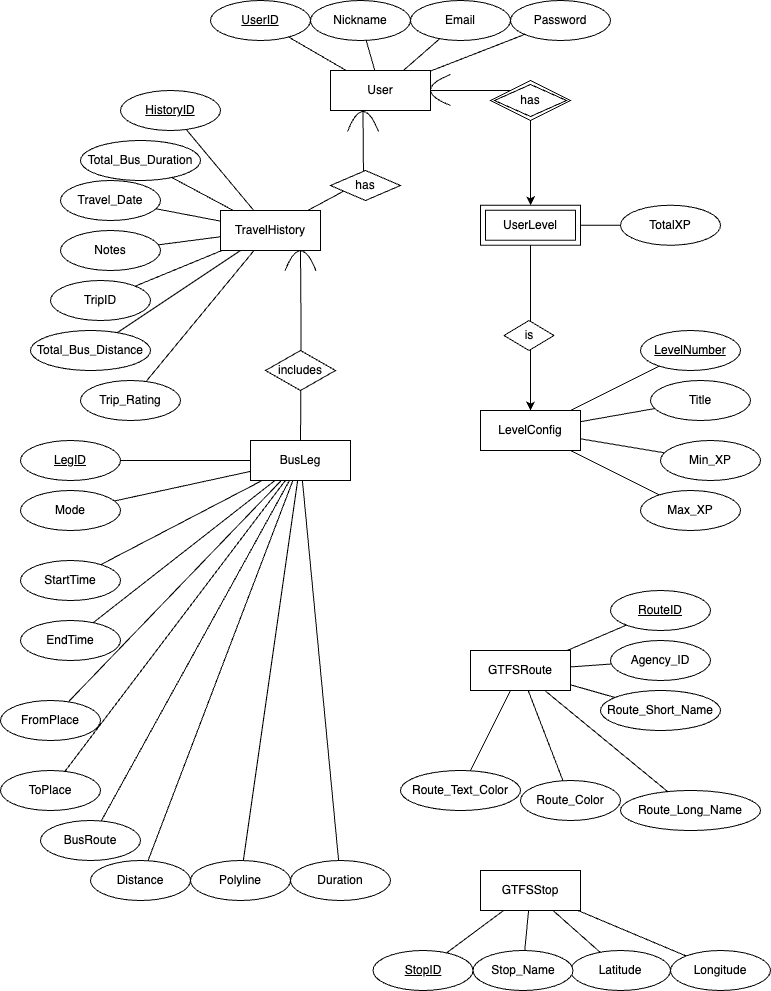
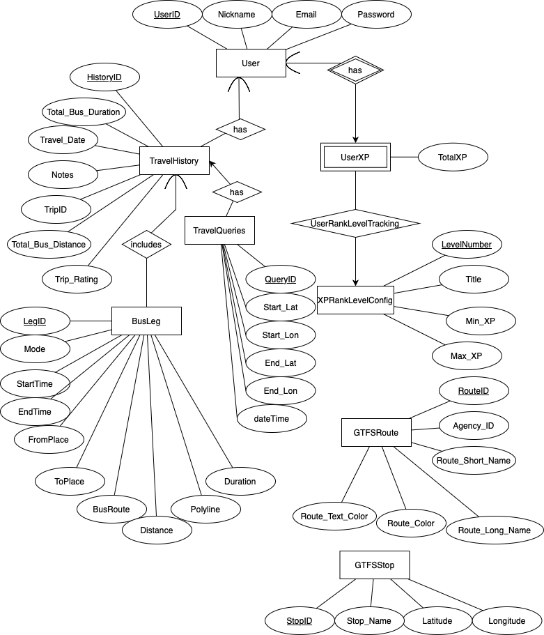

# Project Report

Watch our project demo here: [CS411 BigBallers MTD EcoLeveling Presentation](https://mediaspace.illinois.edu/media/t/1_fpwgurkb)
## 1. Changes from Original Proposal

- **Original Scope:**  
  - Real‐time bus schedules & routes via MTD API  
  - Tiered rewards (free rides, priority seating, seat selection)  
  - Gamified leveling & ranking  
  - Environmental impact tracker  

- **Final Direction:**  
  - Switched to static MTD_GTFS data (sufficient for demo)  
  - Retained gamification: XP, levels, rankings, comparisions
  - Retained Environmental impact tracker - CO₂ saved
  - Dropped real‐time perks (free rides, priority seating) due to scope/time

---

## 2. Application Achievements & Limitations

- **Achieved:**  
  - Easy-to-use trip planner & recommendation  
  - View and CRUD past travel history  
  - Gamification (XP accrual & level UI)  
  - Environmental Impact (Tracking CO₂ saved) 

- **Limitations:**  
  - UI needs more polish (map interactivity, styling)
  - Social/leaderboard features minimal
  - No real-time arrival predictions

---

## 3. Schema & Data Source Changes

- **Data Source:**  
  - Switched from MTD API → static `MTD_GTFS` tables

- **Schema Changes:**  
  - Added `TravelQueries` table to log user search parameters  
```
CREATE TABLE TravelQueries (
  Query_ID    INT AUTO_INCREMENT PRIMARY KEY,
  History_ID  INT,
  Start_Lat   DECIMAL(17,15),
  Start_Lon   DECIMAL(17,15),
  End_Lat     DECIMAL(17,15),
  End_Lon     DECIMAL(17,15),
  dateTime    VARCHAR(30),
  FOREIGN KEY (History_ID)
    REFERENCES TravelHistory(History_ID)
    ON DELETE CASCADE
);
```

  - Added `AUTO_INCREMENT` to all integer PKs  
---

## 4. ER Diagram & Implementation Differences

- **Original ER:**



- **Final ER:**
  

  - Same core entities plus `TravelQueries`  
  - Auto-increment PKs simplify inserts  
  - Minor naming changes

---

## 5. Functionality Added / Removed

- **Added:**  
  - **Login / Logout** system
  - **Map UI** for trip generation and interaction
  - **Travel History** management (view, add, edit, delete trips)
  - **"Compare Yourself"** feature (leaderboard and ranking delta)
  - **Progress Tracker** showing XP, level, and achievements
  - **CO₂ Saved** display for environmental impact

- **Removed:**  
  - Real-time reward fulfillment (free rides, etc.)  
  - Extensive social features  

---

## 6. Advanced Database Programs

### Transactions
- **ISOLATION LEVEL**
  - Read Committed
- **Advanced Queries**
  - Both queries contains criteria: Join multiple relations, Aggregation via GROUP BY
- **Application Functionality**
  - Get top 5 most active Users
  - Get top 5 longest routes

### Triggers
- **AFTER INSERT / UPDATE / DELETE**  
  - Automatically calculate XP deltas and update the `UserXP` table whenever a trip record changes.  
  - Call `updateUserXPAndRank(user_id)` to recalculate and persist the user’s rank.  
- **Benefit:** Real-time enforcement of gamification logic ensures the UI always shows the latest XP and rank without additional application code.

### Stored Procedures
- **`updateUserXPAndRank`**  
  - Centralizes the logic for mapping XP totals to rank levels.  
  - Application code calls this one procedure instead of re-implementing ranking logic in multiple places.
- **`getTopUsersByXPAndTrips`**  
  - Encapsulates leaderboard queries: counts qualifying users and returns the top performers.  
  - Enables the app to fetch a ready-to-display leaderboard in a single call.
  
---

## 7. Technical Challenges & Team Reflections

| Team Member | Technical Challenge & Lessons Learned                                                                                                                                                                                                                                                                                                                                                                                                                                                             |
| ----------- | ------------------------------------------------------------------------------------------------------------------------------------------------------------------------------------------------------------------------------------------------------------------------------------------------------------------------------------------------------------------------------------------------------------------------------------------------------------------------------------------------- |
| **Yu**      | **Authentication, OTP Integration & TravelHistory Management:** Designed and implemented authentication (login/logout endpoints with password and session management) to protect user data; set up Java with the OTP (OpenTripPlanner) shaded JAR, ingested GTFS (General Transit Feed Specification) and OSM (OpenStreetMap) data to build our trip-planning graph, and integrated OTP into the Flask backend; developed an interactive React map UI (using Leaflet) to send routing requests, parse OTP’s JSON responses, and display itineraries; built CRUD endpoints for TravelHistory—including pagination, trip ratings, and notes—and wired them to the frontend, ensuring smooth data flow and state management; populated XP and level using a stored procedure to calculate XP and triggers to update XP and level on TravelHistory updates; and modified the database schema during development to better align with project goals. |
| **Jay**     |  Allen and I implemented the transaction with advanced queries, with the first advanced query outputting the five users that took the most amount of trips on the MTD, and the second advanced query outputting the five routes with the largest leg count. Technical challenges involved choosing relevant advanced queries for our project and figuring out how to apply the transaction to our Flask app. Allen and I also developed the working codebase for Stage 4: Checkpoint 1, which allowed us to add, delete, and read records from the database on our web app. Technical challenges involved figuring out how we would properly connect the frontend and backend, and trying to create the base of our project in a way that is easy for our teammates to modify later.|
| **Rahul**   |  I implemented the leveling system which involved managing user rank and XP, and displaying relevant statistics such as CO₂ saved and rank progress. The challenge was to design a dynamic and user-specific experience, showing a user’s current rank, XP, CO₂ saved, and the progress needed to reach the next rank. I integrated a search feature as well, that allowed users to compare their stats against others, displaying both the user’s rank and XP in a clear and gamified manner. This involved complex backend logic, including querying the database for the necessary user data and implementing the logic to display these stats on the frontend. I utilized one of the SQL stored procedures to optimize and dynamically retrieve the required data, enhancing the user experience. Working on all of this deepened my understanding of Flask, SQL procedures, and creating interactive features that bridge the frontend and backend. |
| **Allen**   | Jay and I implemented the transaction with advanced queries, with the first advanced query outputting the five users that took the most amount of trips on the MTD, and the second advanced query outputting the five routes with the largest leg count. Technical challenges involved choosing relevant advanced queries for our project and figuring out how to apply the transaction to our Flask app. Jay and I also developed the working codebase for Stage 4: Checkpoint 1, which allowed us to add, delete, and read records from the database on our web app. Technical challenges involved figuring out how we would properly connect the frontend and backend, and trying to create the base of our project in a way that is easy for our teammates to modify later. I also came up with the idea of the MTD leveling system, when my teammates were struggling to find a project idea that was not considered too generic, yet fit well with the most available data sets. My inspiration for MTD Leveling comes from me reading manhwa, particularly manhwa with System Users, Aura Swordsmen, and Cultivation. Reading these manhwa shaped my mentality to be much less naive and more desperate for success than my previous self, and I wanted the app to provide the user with a similar feeling, while being eco-friendly through encouraging use of the MTD.|

> **Advice for Future Teams:**  
> 1. **Start your schema & ER design early** and iterate with teammates or your TA—modifying a live database is time-consuming.  
> 2. **Adopt a clear Git branching strategy** (e.g. feature branches + pull requests) to catch merge conflicts early and keep everyone in sync.
> 3. **Have a weekly progress meetup** to discuss work and goals in an incremental fashion so that the team is not burdened with too much work towards the end. 
---

## 8. Other Changes Since Proposal

- We had made no other changes since the proposal
---

## 9. Future Work

- Real-time GTFS integration for live arrivals  
- Multi-criteria route optimization  
- Full leaderboard & social sharing  
- Analytics dashboard (user behavior trends)
- Advanced Environment Impact Tracker (based on real-time data)

---

## 10. Division of Labor & Teamwork

- **Yu:** Prepared GTFS/OSM data; added auth & OTP; built map UI & CRUD; wrote DML & triggers; modified the database schema
- **Jay:** Transaction with advanced queries, Working Codebase for Stage #4: Checkpoint 1 
- **Rahul:** Leveling System, Search Feature, stored procedure utilization; wrote DDL for creating database and tables, importing data
- **Allen:** Transaction with advanced queries, Working Codebase for Stage #4: Checkpoint 1, Spearheaded the Creative Process
- **Team Process:**  
  - **Git:** feature branches 
  - **Meetings:** via Messages, Campuswire room chat, weekly class time.
